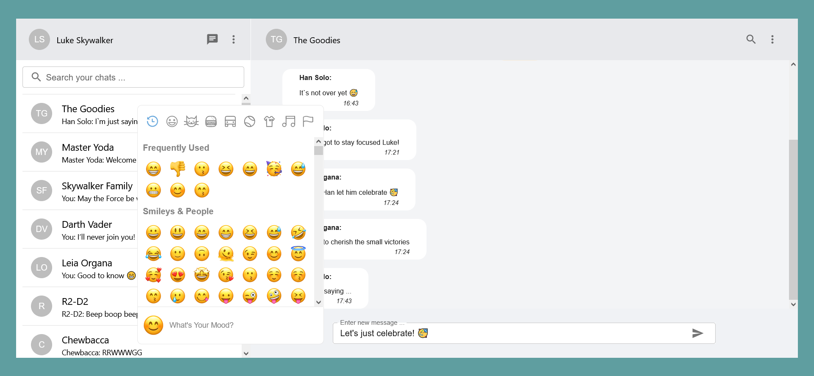

# Chat Application

A full-stack realtime messaging application with a WhatsApp-inspired user interface. Enables users to exchange messages individually or within groups, with support for file sharing and real-time notifications.


## 🚀 Features

- **Realtime Messaging:** Seamless, real-time messaging with instant delivery via WebSocket
- **Individual & Group Chats:** Send private messages or create group conversations
- **File Sharing:** Upload and share images, documents, and other files
- **User Authentication:** Secure JWT-based authentication with Spring Security
- **Responsive Design:** Mobile-friendly interface built with Material UI
- **Message Notifications:** Real-time notifications for new messages
- **User Presence:** Online/offline status indicators

## 🛠️ Technologies

### Frontend
- **React** with TypeScript
- **Redux Toolkit** for state management
- **Material UI** for components
- **WebSocket** for real-time communication

### Backend
- **Spring Boot** 3.5.0
- **Spring Security** for authentication
- **Spring WebSocket** for real-time messaging
- **Spring Data JPA** for database operations
- **PostgreSQL** database
- **JWT** for token-based authentication

### Package
- **Group ID:** `com.team`
- **Artifact ID:** `chatapp`
- **Java Version:** 21

## 📋 Prerequisites

- **Node.js** 16+ and npm
- **Java** 21
- **Maven** 3.6+
- **PostgreSQL** 12+ (or use NeonDB for cloud deployment)

## 🏃 Local Development

### 1. Clone the Repository
```bash
git clone https://github.com/yourusername/chat-app.git
cd chat-app
```

### 2. Setup Backend
```bash
cd backend

# Configure database in src/main/resources/application.properties
# Or use environment variables:
# DATABASE_URL=jdbc:postgresql://localhost:5432/chatapp
# DB_USERNAME=postgres
# DB_PASSWORD=yourpassword

# Build and run
mvn clean install
mvn spring-boot:run
```

Backend runs on `http://localhost:8080`

### 3. Setup Frontend
```bash
cd frontend

# Install dependencies
npm install

# Start development server
npm start
```

Frontend runs on `http://localhost:3000`

### 4. Sample Login Credentials
- **Email:** `luke.skywalker@test.com`
- **Password:** `luke`

Or create your own account via the signup page!

## 🌐 Network Access

Access the app from other devices on your local network:

1. Backend listens on `0.0.0.0:8080` (all interfaces)
2. Frontend listens on `0.0.0.0:3000` (all interfaces)
3. Find your local IP: `ipconfig` (Windows) or `ifconfig` (Mac/Linux)
4. Access from other devices: `http://YOUR_LOCAL_IP:3000`

### Windows Firewall Configuration
```bash
netsh advfirewall firewall add rule name="React Dev Server" dir=in action=allow protocol=TCP localport=3000
netsh advfirewall firewall add rule name="Spring Boot Backend" dir=in action=allow protocol=TCP localport=8080
```

## ☁️ Cloud Deployment (Production)

Deploy to **Vercel** (Frontend), **Render** (Backend), and **NeonDB** (Database) using our automated script:

### Quick Deploy
```bash
# Windows
deploy.bat

# Mac/Linux
chmod +x deploy.sh
./deploy.sh
```

### Manual Deployment Steps

#### 1. Database (NeonDB)
```bash
# Sign up at https://neon.tech
# Create project: chatapp-db
# Copy connection string
```

#### 2. Backend (Render)
```bash
# Build locally first
cd backend
./mvnw clean package -DskipTests

# Then deploy on Render:
# - Go to https://render.com
# - New Web Service from GitHub
# - Root Directory: backend
# - Build: ./mvnw clean package -DskipTests
# - Start: java -Dserver.port=$PORT -Dspring.profiles.active=prod -jar target/chatapp.jar
# - Add environment variables:
#   SPRING_PROFILES_ACTIVE=prod
#   DATABASE_URL=<neondb-connection-string>
#   JWT_SECRET=<generate-with-command-below>
#   FRONTEND_URL=<vercel-url>
```

Generate JWT Secret:
```bash
node -e "console.log(require('crypto').randomBytes(32).toString('hex'))"
```

#### 3. Frontend (Vercel)
```bash
# Install Vercel CLI
npm install -g vercel

# Deploy
cd frontend
vercel --prod
```

Set environment variables in Vercel:
```
REACT_APP_API_BASE_URL=https://your-backend.onrender.com
REACT_APP_WS_URL=wss://your-backend.onrender.com/ws
```

### Free Tier Limits
- **NeonDB:** 0.5 GB storage (sleeps after 5 min inactivity)
- **Render:** 750 hours/month (sleeps after 15 min inactivity)  
- **Vercel:** 100 GB bandwidth

### Production URLs
After deployment, your app will be live at:
- **Frontend:** `https://your-app.vercel.app`
- **Backend:** `https://chatapp-backend.onrender.com`

## 📸 Screenshots

### Homepage


### Send Messages


### Sign In


### Sign Up


### Start Group Chat


### Edit Group Chat


## 🔧 Configuration

### Backend Environment Variables
```properties
# Database
DATABASE_URL=jdbc:postgresql://localhost:5432/chatapp
DB_USERNAME=postgres
DB_PASSWORD=yourpassword

# JWT
JWT_SECRET=your-256-bit-secret-key
JWT_EXPIRATION=86400000

# CORS
FRONTEND_URL=http://localhost:3000

# Server
SERVER_PORT=8080
```

### Frontend Environment Variables
```bash
REACT_APP_API_BASE_URL=http://localhost:8080
REACT_APP_WS_URL=ws://localhost:8080/ws
```

## 🤝 Contributing

Contributions are welcome! Please follow these steps:

1. Fork the repository
2. Create a feature branch (`git checkout -b feature/AmazingFeature`)
3. Commit your changes (`git commit -m 'Add some AmazingFeature'`)
4. Push to the branch (`git push origin feature/AmazingFeature`)
5. Open a Pull Request

## 📝 License

This project is licensed under the [MIT License](LICENSE).

## 🆘 Troubleshooting

### Backend Issues
- **Database Connection Failed:** Verify PostgreSQL is running and credentials are correct
- **Port 8080 Already in Use:** Change port in `application.properties`
- **Build Fails:** Ensure Java 21 and Maven are installed

### Frontend Issues
- **Cannot Connect to Backend:** Check backend is running on port 8080
- **CORS Errors:** Verify `FRONTEND_URL` in backend configuration
- **WebSocket Connection Failed:** Ensure backend WebSocket endpoint is accessible

### Deployment Issues
- **Render Build Fails:** Check Render logs, verify Java version
- **Vercel Build Fails:** Check build logs, verify environment variables
- **CORS on Production:** Update `FRONTEND_URL` in Render to match Vercel URL exactly

## 🙏 Acknowledgments

- Inspired by WhatsApp's user interface
- Built with Spring Boot and React
- Deployed on NeonDB, Render, and Vercel

---

**Made with ❤️ by Team**

For questions or support, please open an issue on GitHub.


